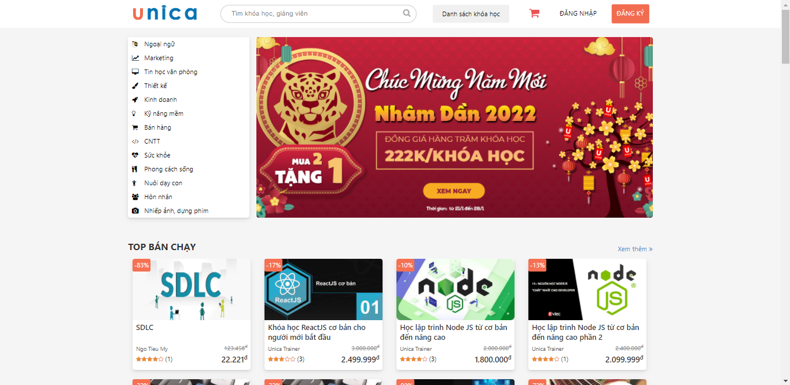
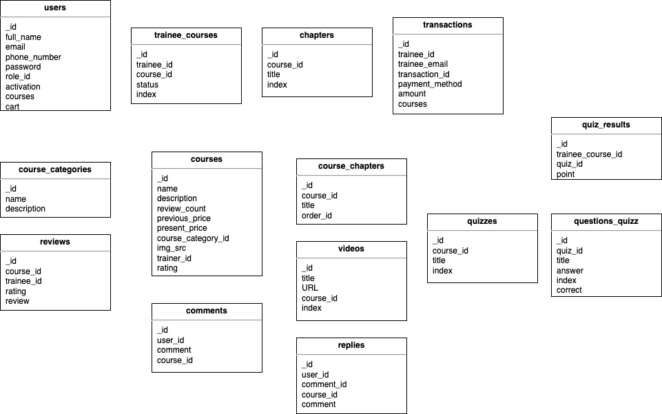

# Unica project &middot; [](https://travis-ci.org/npm/npm) [](https://www.npmjs.com/package/npm) [](http://makeapullrequest.com) [](https://github.com/your/your-project/blob/master/LICENSE) 

This is a project about a course selling platform, similar to Udemy. Live demo
[_here_](https://unica-team2.herokuapp.com/).

## Table of Contents

- [Built With](#built-with)
- [Features](#features)
- [Screenshots](#screenshots)
- [Setup](#setup)
- [Project Status](#project-status)
- [Database](#database)
- [Contributors](#contributors)
- [Acknowledgements](#acknowledgements)
- [Contact](#contact)

## Built With

- [Nodejs](https://nodejs.org/en/) - Platform (Express framework)
- [Mongodb](https://www.mongodb.com/) - Database
- [Bootrap](https://getbootstrap.com/) - Library

## Features

- Create an account, log in, log out
- Search a course by course name/course category (filter)/trainer name
- Add to cart and purchase the course
- Watch video lesson of the course, do the quiz
- Comment and review the course
- Trainer create, update, delete course
- Trainer view the list of trainees for each course
- Admin create, update, delete course categories
- Admin deactivate or reactivated trainee, trainer account

## Screenshots

<div style="display: flex">



</div>

## Setup

```shell
git clone https://github.com/PhucPV1/unica-team2.git
```

```shell
cd unica-team2
```

```shell
npm install
```

```shell
npm run dev
```

## Project Status

Completed

## Database

Database design and schemas, relations: 

## Contributors

- [Pham Van Phuc](https://github.com/PhucPV1/)
- [Ngo Tieu My](https://github.com/ngomy2001)
- [Tran Quoc Cuong](https://github.com/tqcuong11)
- [Le Tien Dung](https://github.com/DungLT-Vimash)
- [Tran Duy Thoang](https://github.com/thoangtran20)

Task Assignment Docs
[Google Sheets](https://docs.google.com/spreadsheets/d/1FdDK7-w4wEvhc-2Stox4IwQXdLbHDIBidKqam131vmw/edit#gid=0)

## Acknowledgements

- This project was inspired by [Unica](https://unica.vn/)
- Many thanks to 2 mentors: Mr. SangVo and Mr. MinhVu

## Contact

Created by [@PhucPV1](https://github.com/PhucPV1/) - feel free to contact me!
